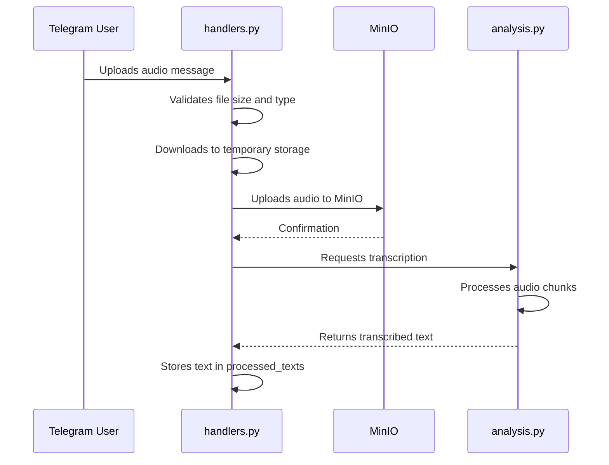
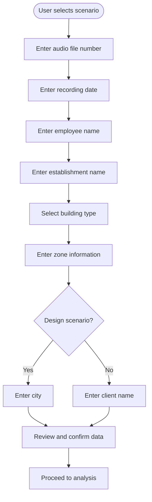
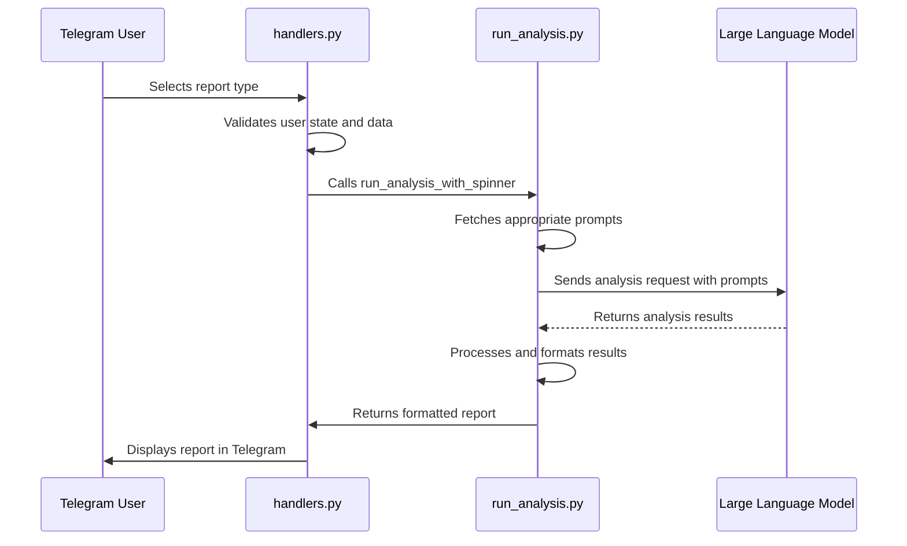
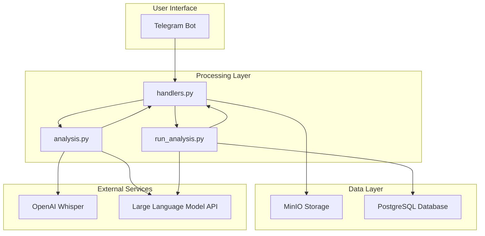

# Audio Analysis Workflow

<cite>
**Referenced Files in This Document**   
- [handlers.py](file://src/handlers.py)
- [storage.py](file://src/storage.py)
- [run_analysis.py](file://src/run_analysis.py)
- [analysis.py](file://src/analysis.py)
- [menus.py](file://src/menus.py)
- [markups.py](file://src/markups.py)
- [validators.py](file://src/validators.py)
- [audio_utils.py](file://src/audio_utils.py)
- [config.py](file://src/config.py)
</cite>

## Table of Contents
1. [Introduction](#introduction)
2. [Audio Upload and Initial Processing](#audio-upload-and-initial-processing)
3. [Transcription and Storage Workflow](#transcription-and-storage-workflow)
4. [User State Management](#user-state-management)
5. [Metadata Collection Process](#metadata-collection-process)
6. [Speaker Role Assignment](#speaker-role-assignment)
7. [Report Generation Pipeline](#report-generation-pipeline)
8. [Error Handling and Validation](#error-handling-and-validation)
9. [Integration Architecture](#integration-architecture)
10. [Practical Interaction Examples](#practical-interaction-examples)

## Introduction
The VoxPersona application implements a comprehensive audio analysis workflow that transforms voice messages into structured reports through a multi-stage processing pipeline. This document details the complete journey of an audio file from initial upload via Telegram to final report generation, covering all intermediate steps including transcription, metadata collection, speaker identification, and analysis orchestration. The system integrates multiple components to provide a seamless experience for users conducting interviews or design audits in hospitality establishments.

## Audio Upload and Initial Processing
The audio analysis workflow begins when a user uploads a voice message through the Telegram interface. The `handlers.py` module captures this input through Pyrogram's message filtering system, specifically designed to handle voice, audio, and document messages. The system supports files up to 2GB in size, accommodating lengthy interview recordings.

When a user sends an audio message, the `handle_audio_msg` function in `handlers.py` initiates the processing pipeline. This function first validates user authorization and checks file size constraints through the `validators.py` module. If the audio file passes these initial checks, the system extracts the filename using `extract_audio_filename` from `audio_utils.py`, which generates a unique identifier when filenames are not provided by the client.

**Section sources**
- [handlers.py](file://src/handlers.py#L500-L550)
- [audio_utils.py](file://src/audio_utils.py#L5-L25)

## Transcription and Storage Workflow
After initial validation, the audio processing workflow proceeds with transcription and storage operations. The system downloads the audio file to a temporary directory and uploads it to MinIO object storage using the configured `MINIO_AUDIO_BUCKET_NAME`. This ensures that original recordings are preserved for future reference or reprocessing.

The transcription process is handled by the `transcribe_audio_and_save` function in `audio_utils.py`, which calls the `transcribe_audio` function from `analysis.py`. This implementation uses OpenAI's Whisper model to convert speech to text, processing the audio in chunks to handle longer recordings efficiently. The transcribed text is stored in the global `processed_texts` dictionary, indexed by the user's chat ID, making it available for subsequent analysis stages.

**Diagram sources**
- [handlers.py](file://src/handlers.py#L500-L600)
- [storage.py](file://src/storage.py#L100-L120)
- [analysis.py](file://src/analysis.py#L200-L250)

**Section sources**
- [handlers.py](file://src/handlers.py#L500-L600)
- [storage.py](file://src/storage.py#L100-L120)
- [analysis.py](file://src/analysis.py#L200-L250)

## User State Management
The VoxPersona application maintains user context throughout the multi-step analysis workflow using a global `user_states` dictionary. This state management system tracks each user's progress through the analysis pipeline, preserving their choices and input data across interactions.

The `user_states` dictionary stores information such as the selected analysis mode (interview or design), current processing step, and collected metadata. When a user begins the analysis process, their state is initialized with a specific mode and an empty data dictionary. As the user progresses through the workflow, the state is updated to reflect their current position in the process flow.

State transitions are managed through a step-based system where each step corresponds to a specific data collection or processing phase. For example, after audio processing, the user's state is set to "inputing_fields" to indicate that metadata collection should begin. The system also supports state rollback through the "edit" functionality, allowing users to modify previously entered information.

**Section sources**
- [handlers.py](file://src/handlers.py#L100-L150)
- [config.py](file://src/config.py#L10-L20)

## Metadata Collection Process
Following audio processing, the system initiates a structured metadata collection phase through interactive Telegram menus. Users are guided through a series of prompts to provide essential contextual information about the recording. The metadata collection process varies slightly depending on whether the user has selected the "interview" or "design" scenario.

For both scenarios, users must provide the audio file number, recording date, employee name, establishment name, building type, and zone information. In the design scenario, additional information about the city is required. The system presents this information collection as a step-by-step process, with each step handled by specific functions in `handlers.py` such as `ask_audio_number`, `ask_date`, and `ask_employee`.

The interactive menus are implemented in `markups.py` and `menus.py`, providing users with both text input fields and callback-based selection options. The `building_type_menu_markup` function presents users with choices for hotel, restaurant, or spa establishments, while the `confirm_menu_markup` function allows users to review and confirm their entered data before proceeding to analysis.

**Diagram sources**
- [handlers.py](file://src/handlers.py#L150-L300)
- [markups.py](file://src/markups.py#L50-L100)
- [menus.py](file://src/menus.py#L50-L80)

**Section sources**
- [handlers.py](file://src/handlers.py#L150-L300)
- [markups.py](file://src/markups.py#L50-L100)
- [menus.py](file://src/menus.py#L50-L80)

## Speaker Role Assignment
For interview scenarios, the system performs speaker role assignment to identify different participants in multi-party conversations. This process is triggered automatically after transcription when the user has selected the interview mode. The `handle_assign_roles` function in `handlers.py` coordinates this operation, which uses a specialized prompt-based classification system.

The role assignment process leverages the `assign_roles` function from `analysis.py`, which sends the transcribed text to an LLM with a specific prompt designed to identify and label different speakers. This prompt-based approach allows the system to distinguish between interviewer and interviewee voices, even when speaker changes are not explicitly marked in the original recording.

The role assignment enhances the quality of subsequent analysis by providing structured dialogue context. The processed text with assigned roles replaces the original transcription in the `processed_texts` dictionary, ensuring that all downstream analysis benefits from the improved structure. This step is particularly valuable for interview methodology assessment and factor analysis reports.

**Section sources**
- [handlers.py](file://src/handlers.py#L400-L450)
- [analysis.py](file://src/analysis.py#L400-L450)

## Report Generation Pipeline
The final stage of the audio analysis workflow is report generation, orchestrated by the `run_analysis.py` module. After metadata collection and confirmation, users select from available report types through interactive menus, triggering the analysis pipeline. The system supports different report categories for interview and design scenarios, each with specific analytical focuses.

When a user selects a report type, the `handle_report` function in `handlers.py` processes the request and routes it to `run_analysis_with_spinner` in `run_analysis.py`. This function implements a multi-pass analysis approach for complex reports, particularly evident in the "Information about common decision-making factors" report for interviews, which requires two separate analysis passes before final aggregation.

The analysis pipeline retrieves structured prompts from the `prompts-by-scenario` directory based on the selected scenario, report type, and establishment type. These prompts guide the LLM in generating comprehensive reports with consistent formatting and analytical depth. For JSON-formatted reports, the system performs a two-step process: first generating detailed analysis text, then extracting structured data according to predefined schemas.

**Diagram sources**
- [handlers.py](file://src/handlers.py#L700-L750)
- [run_analysis.py](file://src/run_analysis.py#L200-L300)
- [analysis.py](file://src/analysis.py#L50-L100)

**Section sources**
- [handlers.py](file://src/handlers.py#L700-L750)
- [run_analysis.py](file://src/run_analysis.py#L200-L300)

## Error Handling and Validation
The audio analysis workflow incorporates comprehensive error handling and validation mechanisms to ensure system reliability and data integrity. Validation occurs at multiple levels throughout the processing pipeline, from initial file upload to final report generation.

The `validators.py` module provides essential validation functions for different aspects of the workflow. The `validate_date_format` function ensures date inputs follow the YYYY-MM-DD format, while `check_audio_file_size` prevents oversized files from overwhelming system resources. The `validate_building_type` function normalizes user inputs for establishment types, converting variations like "hotel" or "отель" into standardized categories.

Error recovery paths are integrated into the workflow design. When transcription fails due to API issues, the system notifies the user and returns to the main menu without losing their session state. Similarly, if prompt retrieval fails during report generation, the system logs the error and provides appropriate user feedback. The temporary file cleanup system ensures that partial processing does not leave behind orphaned files, with the `delete_tmp_params` function removing temporary audio files and directories after processing completes.

**Section sources**
- [validators.py](file://src/validators.py#L1-L50)
- [handlers.py](file://src/handlers.py#L550-L600)
- [storage.py](file://src/storage.py#L80-L100)

## Integration Architecture
The VoxPersona audio analysis workflow demonstrates a modular architecture with clear separation of concerns among its components. The system integrates multiple external services and internal modules to deliver a cohesive user experience, with well-defined interfaces between components.

The core integration points include Telegram for user interaction, MinIO for audio storage, and external LLM APIs for transcription and analysis. Configuration parameters for these integrations are managed in `config.py`, providing a centralized location for service endpoints, credentials, and operational settings. The system uses environment variables and configuration files to maintain separation between code and configuration.

Data flows through the system in a pipeline fashion, with each component processing the output of the previous stage. The `processed_texts` dictionary serves as a shared data store between transcription and analysis components, while the `user_states` dictionary maintains user context across interaction boundaries. This architecture enables both synchronous processing for immediate feedback and asynchronous operations for resource-intensive tasks.

**Diagram sources**
- [handlers.py](file://src/handlers.py#L1-L50)
- [analysis.py](file://src/analysis.py#L1-L50)
- [run_analysis.py](file://src/run_analysis.py#L1-L50)
- [storage.py](file://src/storage.py#L1-L50)

**Section sources**
- [handlers.py](file://src/handlers.py#L1-L50)
- [analysis.py](file://src/analysis.py#L1-L50)
- [run_analysis.py](file://src/run_analysis.py#L1-L50)

## Practical Interaction Examples
The audio analysis workflow supports several practical interaction sequences that reflect real-world usage patterns. A typical successful interaction begins with a user uploading an audio file, which triggers automatic transcription and storage. The system then guides the user through the metadata collection process with a series of prompts, culminating in report generation.

Valid interaction sequences include:
1. Upload audio → Enter metadata → Select report type → Receive analysis
2. Select scenario → Upload audio → Automatic metadata parsing → Generate report
3. Use stored audio → Confirm existing metadata → Select different report type → Receive alternative analysis

Common error conditions and their recovery paths include:
- Invalid audio format: System rejects file and prompts for re-upload
- Incorrect date format: System requests correction with example format
- Missing required metadata: System identifies missing fields and requests completion
- Transcription API failure: System notifies user and returns to main menu

The system also supports advanced interactions such as editing previously entered metadata through the "edit" menu options, allowing users to correct mistakes without restarting the entire process. For complex analyses requiring multiple reports, users can generate sequential outputs by selecting different report types after a single audio processing cycle.

**Section sources**
- [handlers.py](file://src/handlers.py#L300-L400)
- [validators.py](file://src/validators.py#L1-L50)
- [menus.py](file://src/menus.py#L1-L50)