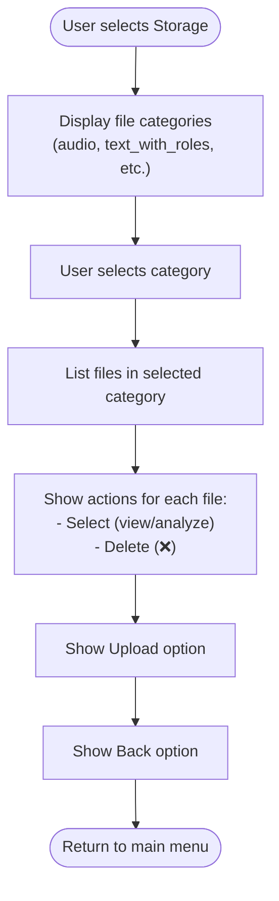
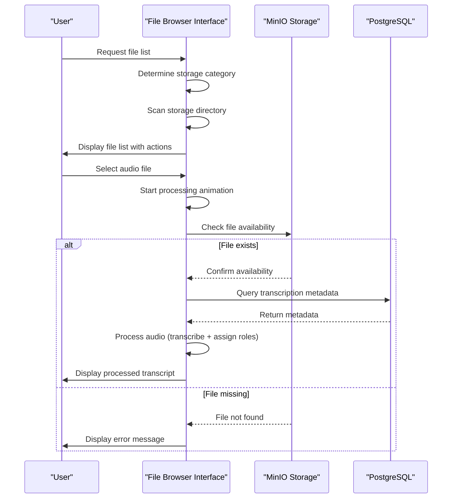
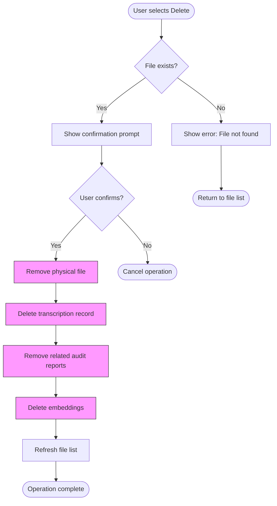
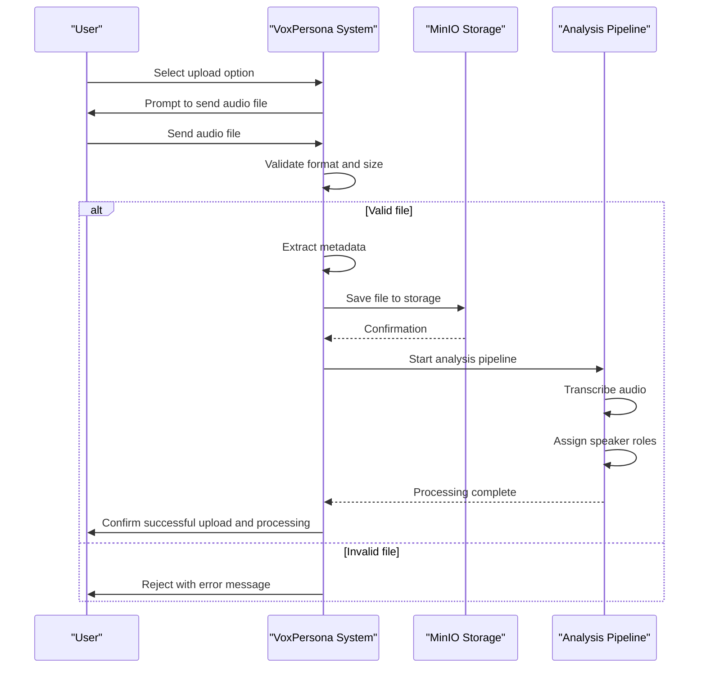
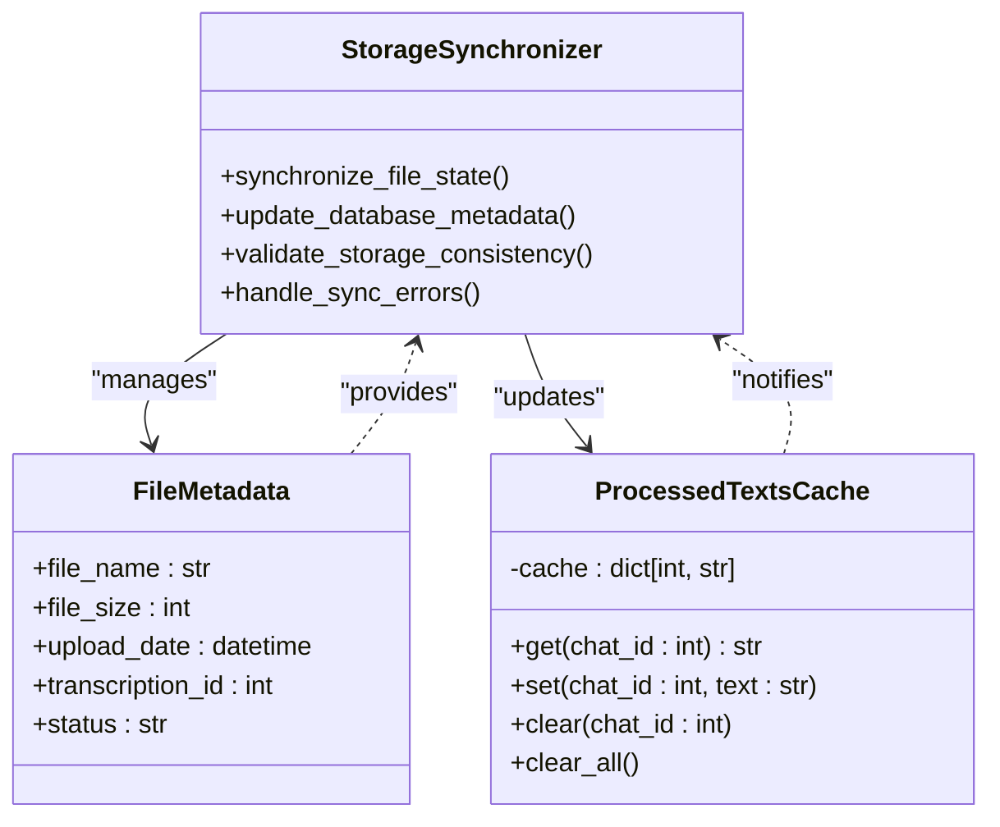
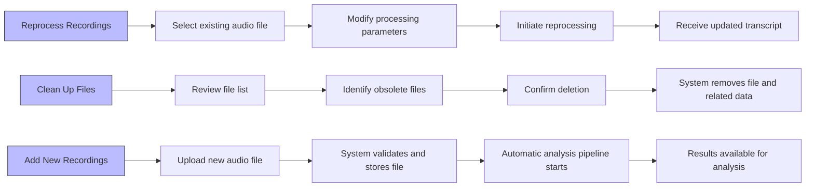
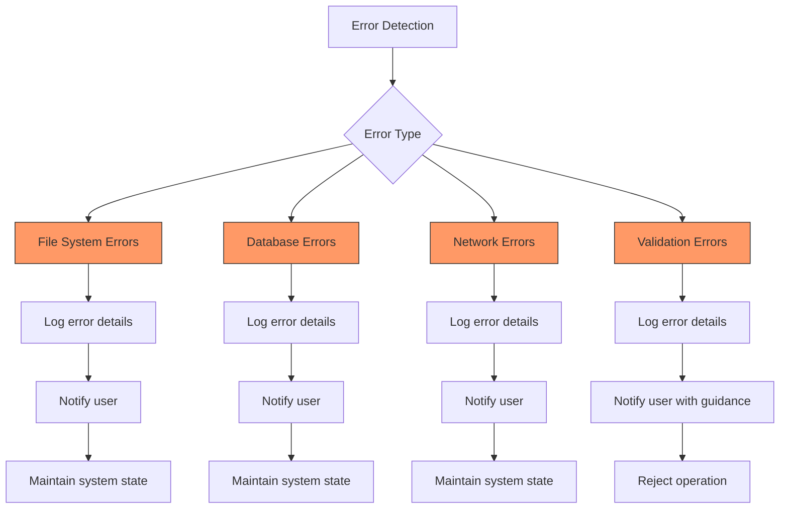

# File Management Workflow

<cite>
**Referenced Files in This Document**   
- [handlers.py](file://src/handlers.py)
- [menus.py](file://src/menus.py)
- [markups.py](file://src/markups.py)
- [db.py](file://src/db_handler/db.py)
- [storage.py](file://src/storage.py)
- [config.py](file://src/config.py)
</cite>

## Table of Contents
1. [Introduction](#introduction)
2. [File Browser Interface](#file-browser-interface)
3. [File Retrieval Logic](#file-retrieval-logic)
4. [Delete Workflow](#delete-workflow)
5. [Upload Process](#upload-process)
6. [Synchronization and Caching](#synchronization-and-caching)
7. [Real-World Usage Patterns](#real-world-usage-patterns)
8. [Error Handling and Storage Management](#error-handling-and-storage-management)

## Introduction
VoxPersona provides comprehensive file management capabilities for audio recordings and processed transcripts. The system integrates a user-friendly file browser interface with robust backend operations for storing, retrieving, and processing audio files. This document details the complete file management workflow, covering viewing stored files, uploading new recordings, deleting existing files, and the underlying synchronization between database metadata and object storage. The implementation ensures efficient processing through caching mechanisms and handles various edge cases and error conditions to maintain system reliability.

## File Browser Interface

The file browser interface in VoxPersona allows users to view, select, and manage their stored audio files through an interactive menu system built with `menus.py` and `markups.py`. Users access the file management functionality from the main menu by selecting the "Storage" option, which presents categories of stored files.

The interface displays files in a structured format with options to view, select, or delete individual files. Each file entry includes a filename and a delete button (❌), while additional options allow users to upload new files or navigate back to the main menu. The file browser dynamically generates this interface by scanning the designated storage directories and creating callback buttons for each file operation.

**Diagram sources**
- [menus.py](file://src/menus.py#L5-L45)
- [markups.py](file://src/markups.py#L45-L65)

**Section sources**
- [menus.py](file://src/menus.py#L5-L94)
- [markups.py](file://src/markups.py#L45-L133)

## File Retrieval Logic

The file retrieval process in VoxPersona involves querying both PostgreSQL for metadata and MinIO for file availability. When a user requests to view files in a specific category, the system first determines the appropriate storage directory from the configuration and lists all files in that directory.

For audio files, the retrieval logic includes additional processing steps. When a user selects an audio file for analysis, the system initiates a processing workflow that transcribes the audio and assigns speaker roles. The retrieval process validates file existence and handles potential errors such as missing files or processing failures.

The integration between the database and object storage ensures that metadata about files is consistently maintained. The system queries the PostgreSQL database to retrieve transcription records and related metadata, while simultaneously checking MinIO for the physical availability of the audio files.

**Diagram sources**
- [handlers.py](file://src/handlers.py#L150-L180)
- [storage.py](file://src/storage.py#L150-L200)
- [db.py](file://src/db_handler/db.py#L300-L350)

**Section sources**
- [handlers.py](file://src/handlers.py#L150-L200)
- [storage.py](file://src/storage.py#L150-L250)

## Delete Workflow

The delete workflow in VoxPersona implements a comprehensive cascading removal process that ensures data consistency across the system. When a user requests to delete a file, the system first validates the file's existence and then proceeds with removal operations.

The deletion process removes the physical file from the storage directory and triggers cascading removal of related records from the database. This includes deleting transcription records, associated audit reports, and any generated embeddings. The workflow includes confirmation prompts to prevent accidental deletions, ensuring users explicitly confirm their intent before permanent removal.

The system handles potential errors during deletion, such as file system permissions issues or database constraint violations, and provides appropriate feedback to the user. After successful deletion, the file browser interface is automatically refreshed to reflect the updated file list.

**Diagram sources**
- [handlers.py](file://src/handlers.py#L182-L195)
- [storage.py](file://src/storage.py#L130-L140)
- [db.py](file://src/db_handler/db.py#L200-L250)

**Section sources**
- [handlers.py](file://src/handlers.py#L182-L195)
- [storage.py](file://src/storage.py#L130-L140)

## Upload Process

The upload process for new audio files in VoxPersona includes comprehensive validation and automatic initiation of the analysis pipeline. When a user selects the upload option, the system prompts them to send an audio file, which is then subjected to format and size validation.

The validation process checks both the file format and size against predefined limits, rejecting files that exceed the maximum size of 2GB. For valid files, the system automatically saves them to the appropriate storage directory and immediately restarts the analysis pipeline, which includes transcription and speaker role assignment.

The upload workflow handles various file types, including voice messages, audio files, and document-attached audio, extracting appropriate metadata from each. After successful upload and validation, the system provides confirmation to the user and makes the file available in the file browser for immediate analysis.

**Diagram sources**
- [handlers.py](file://src/handlers.py#L400-L450)
- [audio_utils.py](file://src/audio_utils.py#L30-L50)
- [config.py](file://src/config.py#L70-L80)

**Section sources**
- [handlers.py](file://src/handlers.py#L400-L450)
- [audio_utils.py](file://src/audio_utils.py#L30-L50)

## Synchronization and Caching

VoxPersona maintains strict synchronization between database entries and object storage to ensure data consistency. When files are uploaded, modified, or deleted, corresponding database records are updated to reflect the current state of the object storage. This bidirectional synchronization prevents data discrepancies and ensures that the file browser interface always displays accurate information.

The system implements a `processed_texts` cache to improve performance by storing recently processed transcripts in memory. This cache reduces the need for repeated processing of the same audio files, significantly improving response times for frequently accessed files. The cache is managed through a dictionary structure keyed by user chat ID, allowing personalized access to processed content.

The synchronization mechanism includes error handling for cases where database updates fail, ensuring that partial updates do not leave the system in an inconsistent state. Transactional operations are used where appropriate to maintain atomicity of related operations.

**Diagram sources**
- [storage.py](file://src/storage.py#L50-L100)
- [config.py](file://src/config.py#L85-L90)
- [db.py](file://src/db_handler/db.py#L100-L150)

**Section sources**
- [storage.py](file://src/storage.py#L50-L150)
- [config.py](file://src/config.py#L85-L90)

## Real-World Usage Patterns

In real-world usage, VoxPersona's file management capabilities support several common patterns. Users frequently reprocess updated recordings when they need to refine analysis results or apply different processing parameters. The system's caching mechanism makes reprocessing efficient by avoiding redundant transcription operations.

Another common pattern involves cleaning up old files to manage storage quotas and maintain a focused dataset. Users typically review their file lists periodically and remove recordings that are no longer needed for analysis. The cascading delete functionality ensures that removing a file also removes all associated analysis results, maintaining data integrity.

Users also leverage the upload functionality to continuously add new recordings to their analysis pipeline. The automatic processing that follows upload allows for immediate analysis without additional user intervention, supporting a workflow of continuous data ingestion and analysis.

**Diagram sources**
- [handlers.py](file://src/handlers.py#L150-L200)
- [storage.py](file://src/storage.py#L150-L200)
- [analysis.py](file://src/analysis.py#L1-L20)

**Section sources**
- [handlers.py](file://src/handlers.py#L150-L200)
- [storage.py](file://src/storage.py#L150-L200)

## Error Handling and Storage Management

The file management system in VoxPersona includes comprehensive error handling for various failure scenarios. For failed deletions, the system logs the error condition and provides user feedback while attempting to maintain system stability. Corrupted uploads are detected through validation checks and rejected before they can affect system integrity.

Storage quota management is implemented through size limits on uploaded files (2GB maximum) and monitoring of storage directory usage. When storage limits are approached, the system can trigger alerts or automated cleanup processes. The error handling framework includes specific handlers for common issues such as network connectivity problems with MinIO, database connection failures, and file system permission errors.

The system logs all error conditions for diagnostic purposes and provides meaningful error messages to users without exposing sensitive system information. Recovery procedures are designed to return the system to a stable state, allowing users to retry operations after addressing the underlying issue.

**Diagram sources**
- [handlers.py](file://src/handlers.py#L50-L100)
- [storage.py](file://src/storage.py#L200-L250)
- [db.py](file://src/db_handler/db.py#L350-L400)

**Section sources**
- [handlers.py](file://src/handlers.py#L50-L100)
- [storage.py](file://src/storage.py#L200-L250)