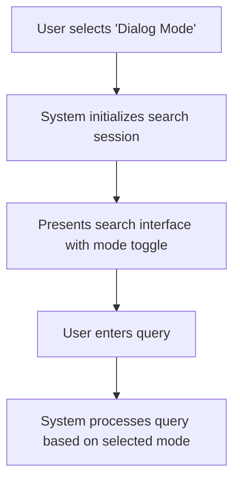
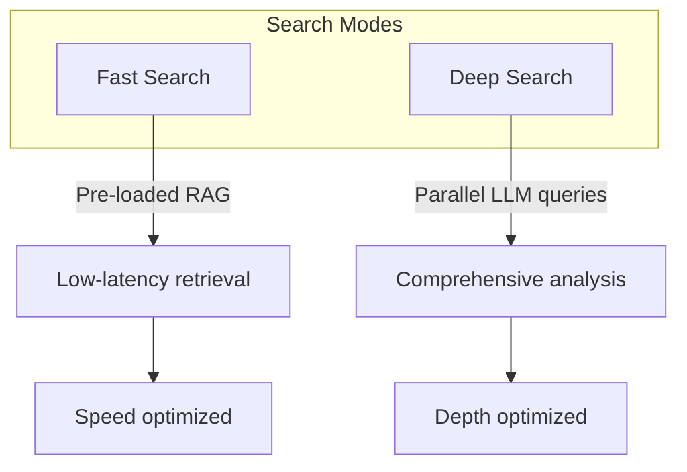
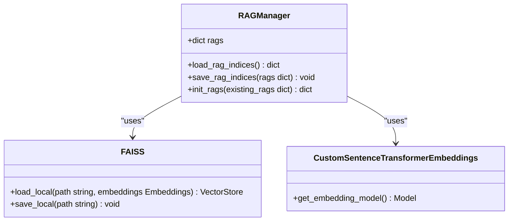
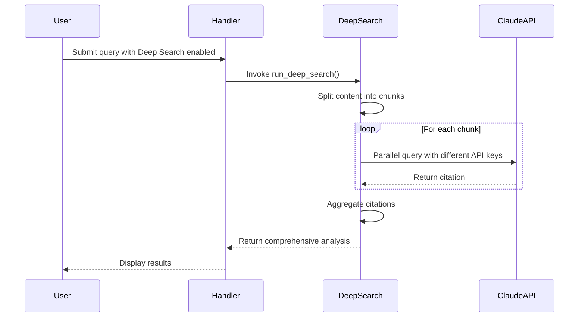
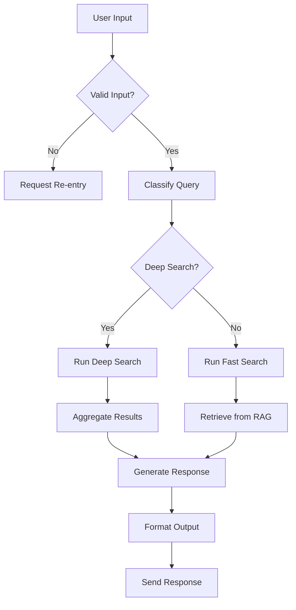
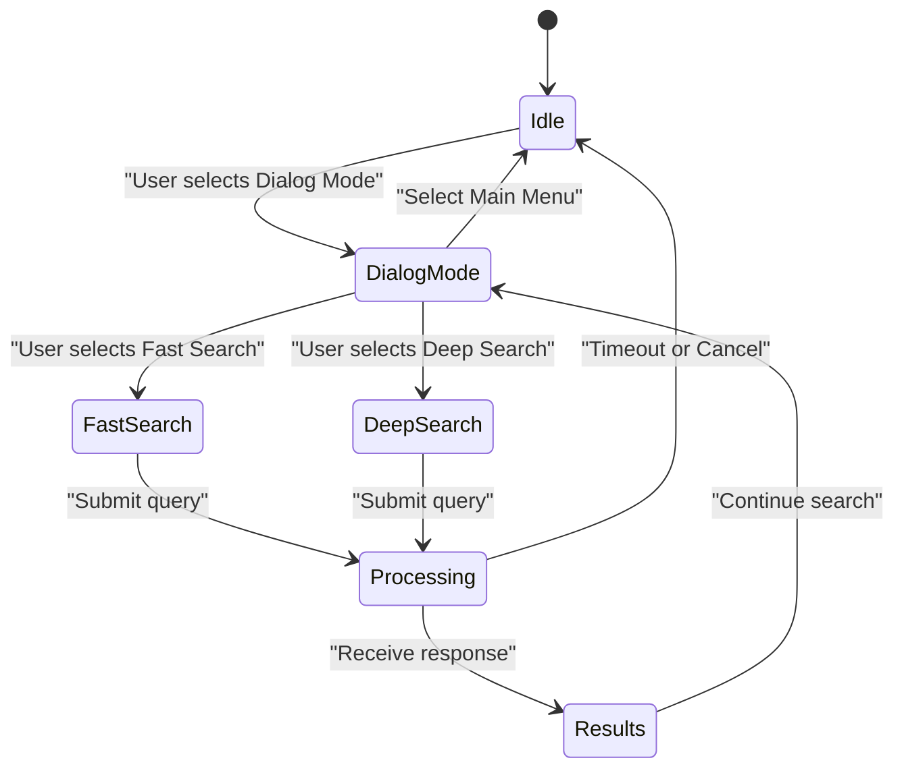

# Search Workflow

<cite>
**Referenced Files in This Document**   
- [menus.py](file://src/menus.py)
- [markups.py](file://src/markups.py)
- [handlers.py](file://src/handlers.py)
- [rag_persistence.py](file://src/rag_persistence.py)
- [run_analysis.py](file://src/run_analysis.py)
</cite>

## Table of Contents
1. [Introduction](#introduction)
2. [Accessing Dialog Mode](#accessing-dialog-mode)
3. [Search Modes Overview](#search-modes-overview)
4. [Fast Search Implementation](#fast-search-implementation)
5. [Deep Search Implementation](#deep-search-implementation)
6. [Query Processing Flow](#query-processing-flow)
7. [State Management](#state-management)
8. [Performance Considerations](#performance-considerations)
9. [Troubleshooting Guide](#troubleshooting-guide)

## Introduction
The VoxPersona system provides a comprehensive search functionality through its Dialog mode, enabling users to retrieve insights from historical audit records and interview transcripts. This document details the complete workflow from user interaction to response generation, covering both Fast Search and Deep Search modes. The system leverages a RAG (Retrieval-Augmented Generation) architecture for efficient information retrieval and analysis, with careful state management and performance optimization.

## Accessing Dialog Mode
Users access the search functionality through the Dialog menu option in the main interface. When selecting "Режим диалога" (Dialog Mode) from the main menu, the system initializes a search session and presents users with search options.

**Diagram sources**
- [markups.py](file://src/markups.py#L45-L50)
- [handlers.py](file://src/handlers.py#L740-L745)

**Section sources**
- [menus.py](file://src/menus.py#L70-L93)
- [markups.py](file://src/markups.py#L10-L15)
- [handlers.py](file://src/handlers.py#L740-L745)

## Search Modes Overview
VoxPersona offers two distinct search modes to balance speed and comprehensiveness:

### Fast Search
Fast Search utilizes a pre-loaded RAG system for low-latency retrieval. This mode is optimized for quick responses by leveraging pre-processed knowledge indices stored in FAISS vector databases. The system loads these indices at startup from the RAG_INDEX_DIR specified in the configuration.

### Deep Search
Deep Search performs parallel LLM queries across historical reports for comprehensive analysis. This mode is designed for in-depth investigations, executing multiple concurrent queries to Claude API endpoints using a pool of API keys. It processes content in chunks and aggregates results for a thorough analysis.

**Diagram sources**
- [rag_persistence.py](file://src/rag_persistence.py#L10-L36)
- [run_analysis.py](file://src/run_analysis.py#L100-L130)

**Section sources**
- [handlers.py](file://src/handlers.py#L600-L630)
- [run_analysis.py](file://src/run_analysis.py#L80-L150)

## Fast Search Implementation
Fast Search relies on a pre-loaded RAG system managed in rag_persistence.py. The system initializes RAG indices at startup, loading them from persistent storage into memory for immediate access.

The RAG system uses FAISS vector databases with SentenceTransformer embeddings to enable semantic search capabilities. Indices are organized by scenario (Interview, Design) and report type, allowing for targeted retrieval based on the query classification.

**Diagram sources**
- [rag_persistence.py](file://src/rag_persistence.py#L10-L36)
- [run_analysis.py](file://src/run_analysis.py#L10-L40)

**Section sources**
- [rag_persistence.py](file://src/rag_persistence.py#L10-L36)
- [run_analysis.py](file://src/run_analysis.py#L10-L80)

## Deep Search Implementation
Deep Search performs parallel LLM queries across historical reports using multiple Claude API keys. The system splits content into chunks and processes them concurrently to maximize throughput and analysis depth.

The implementation uses asynchronous processing with aiohttp to handle multiple API requests efficiently. It employs a pool of seven API keys to distribute the load and avoid rate limiting, enabling comprehensive analysis of large datasets.

**Diagram sources**
- [run_analysis.py](file://src/run_analysis.py#L80-L130)
- [config.py](file://src/config.py#L20-L28)

**Section sources**
- [run_analysis.py](file://src/run_analysis.py#L80-L130)
- [config.py](file://src/config.py#L20-L28)

## Query Processing Flow
The query processing flow begins when users enter text in Dialog mode. The handlers.py module manages the input loop, validates user input, and routes requests to the appropriate analysis functions.

The system first classifies the query to determine the relevant scenario (Interview or Design), then routes it to either Fast Search or Deep Search based on the user's selection. The processing flow includes context retrieval, prompt assembly, and response generation using stored audit records.

**Diagram sources**
- [handlers.py](file://src/handlers.py#L500-L650)
- [run_analysis.py](file://src/run_analysis.py#L130-L200)

**Section sources**
- [handlers.py](file://src/handlers.py#L500-L650)
- [run_analysis.py](file://src/run_analysis.py#L130-L200)

## State Management
The system maintains search session state using the user_states dictionary in config.py. Each user session tracks the current mode (dialog_mode), search type (deep_search), and other contextual information.

Sessions have built-in timeout behavior and support cancellation through the main menu navigation. The system clears active menus when transitioning between states to prevent conflicts and ensure a clean user interface.

**Diagram sources**
- [config.py](file://src/config.py#L60-L70)
- [handlers.py](file://src/handlers.py#L740-L760)

**Section sources**
- [config.py](file://src/config.py#L60-L70)
- [handlers.py](file://src/handlers.py#L740-L760)

## Performance Considerations
The two search modes represent a deliberate trade-off between speed and comprehensiveness:

### Fast Search Characteristics
- **Latency**: Low (typically under 5 seconds)
- **Resource Usage**: Minimal API calls
- **Best For**: Quick fact retrieval, simple queries, frequent searches

### Deep Search Characteristics
- **Latency**: Higher (proportional to content volume)
- **Resource Usage**: Multiple parallel API calls
- **Best For**: Comprehensive analysis, complex queries, investigative research

Users should select Fast Search for routine inquiries and Deep Search when thorough analysis is required. The system's parallel processing in Deep Search mode helps mitigate latency by distributing work across multiple API endpoints.

**Section sources**
- [run_analysis.py](file://src/run_analysis.py#L80-L150)
- [config.py](file://src/config.py#L20-L28)

## Troubleshooting Guide
This section addresses common issues users may encounter with the search functionality.

### Empty Results
When searches return no results, consider:
- Verify the query is within the domain of available audit records
- Check if the RAG indices are properly loaded (system message indicates loading status)
- Ensure the audio/text content has been properly processed and indexed
- Try rephrasing the query using different terminology

### Slow Responses
For performance issues:
- Fast Search should respond quickly; delays may indicate RAG loading issues
- Deep Search performance depends on content volume and API availability
- Network connectivity can affect response times
- System resource constraints may impact processing speed

### Input Validation Issues
The system validates user inputs and will prompt for corrections when:
- Date formats don't match YYYY-MM-DD requirement
- Required fields are missing
- Text input is empty or contains only whitespace

**Section sources**
- [handlers.py](file://src/handlers.py#L500-L650)
- [validators.py](file://src/validators.py#L1-L50)
- [run_analysis.py](file://src/run_analysis.py#L130-L200)