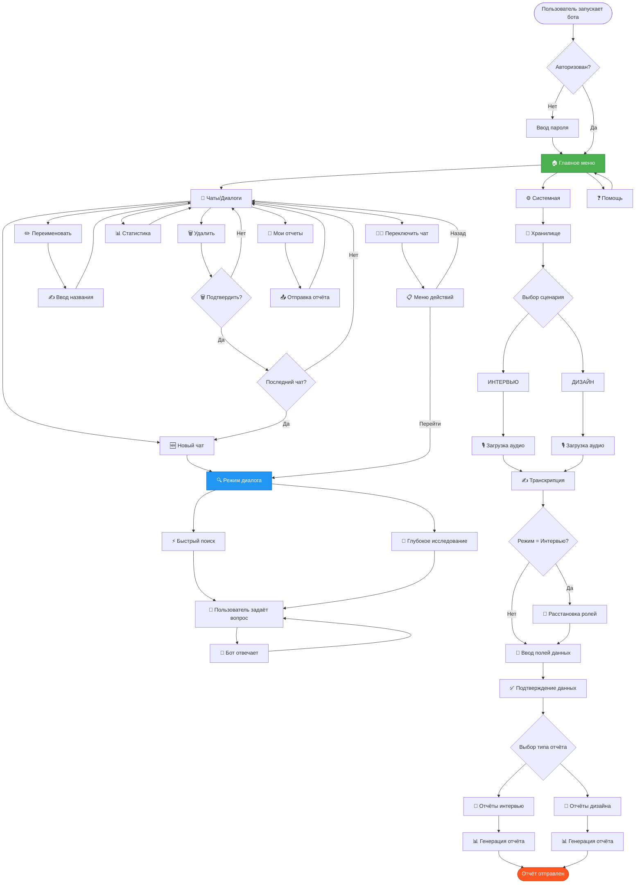

# 🗺️ VoxPersona UI - Карта навигации и потоки взаимодействия

## 🎯 Основной граф навигации



---

## 🔄 Детальный flow: Управление чатами

```
┌─────────────────────────────────────────────────────────────┐
│                     📱 МЕНЮ ЧАТОВ                           │
├─────────────────────────────────────────────────────────────┤
│  [🆕 Новый чат]                    [« Назад]                │
│  [📊 Статистика]                   [📄 Мои отчеты]          │
├─────────────────────────────────────────────────────────────┤
│  [📝 1. Активный чат (2025-01-15)] [✏️] [🗑️]               │
│  [💬 2. Другой чат (2025-01-10)]   [✏️] [🗑️]               │
│  [💬 3. Старый чат (2025-01-05)]   [✏️] [🗑️]               │
└─────────────────────────────────────────────────────────────┘
      │          │          │         │    │
      │          │          │         │    └─────┐
      │          │          │         │          │
      │          │          │         └─────┐    │
      │          │          │               │    │
      │          │          └──────┐        │    │
      │          │                 │        │    │
      │          └────────┐        │        │    │
      │                   │        │        │    │
      ▼                   ▼        ▼        ▼    ▼

┌──────────────┐  ┌──────────┐  ┌────────┐  ┌────┐  ┌────┐
│🆕 Новый чат  │  │📊 Стат.  │  │📄 Отчёты│  │✏️  │  │🗑️  │
└──────────────┘  └──────────┘  └────────┘  └────┘  └────┘
      │                │             │         │       │
      ▼                ▼             ▼         ▼       ▼

┌──────────────┐  ┌──────────┐  ┌────────┐  ┌────────┐  ┌──────────┐
│ 1. clear_    │  │Показывает│  │Список  │  │Запрос  │  │Запрос    │
│    menus()   │  │текст +   │  │отчётов │  │нового  │  │подтверж- │
│ 2. Создать   │  │меню чатов│  │с кнопка-│  │названия│  │дения     │
│    conv_id   │  │          │  │ми      │  │        │  │          │
│ 3. Установить│  │          │  │        │  │        │  │          │
│    user_     │  │          │  │        │  │        │  │          │
│    states    │  │          │  │        │  │        │  │          │
│ 4. Показать  │  │          │  │        │  │        │  │          │
│    режим     │  │          │  │        │  │        │  │          │
│    диалога   │  │          │  │        │  │        │  │          │
└──────────────┘  └──────────┘  └────────┘  └────────┘  └──────────┘
      │                                         │             │
      ▼                                         ▼             ▼

┌──────────────────────────────────┐  ┌──────────┐  ┌──────────────┐
│ ✨ Новый чат создан!             │  │✍️ Ввод   │  │⚠️ Удалить    │
│                                  │  │текста    │  │чат?          │
│ Какую информацию вы хотели бы    │  │          │  │              │
│ получить?                        │  │          │  │Это действие  │
│                                  │  │          │  │необратимо.   │
│ Выберите действие:               │  │          │  │              │
│ [⚡ Быстрый] [🔬 Глубокое]       │  │          │  │[🗑️ Да][❌Нет]│
│ [📱 Чаты/Диалоги]                │  │          │  │              │
└──────────────────────────────────┘  └──────────┘  └──────────────┘
                                           │             │
                                           ▼             ▼

                                   ┌──────────┐  ┌──────────────┐
                                   │✅ Переим-│  │Удалить +     │
                                   │енован    │  │проверка:     │
                                   │          │  │              │
                                   │Ваши чаты:│  │Последний?    │
                                   │[Меню]    │  │Да → Создать  │
                                   │          │  │Нет → [Меню]  │
                                   └──────────┘  └──────────────┘
```

---

## 💬 Flow: Режим диалога (вопрос-ответ)

```
Пользователь в режиме диалога
         │
         ├─ conversation_id установлен? ───[Нет]──→ ensure_active_conversation()
         │                                               │
         └─[Да]                                         │
                │                                        │
                ▼                                        ▼
         ┌─────────────────────────┐          ┌──────────────────┐
         │ user_states[chat_id] =  │          │ Создать новый    │
         │ {                       │          │ conversation_id  │
         │   conversation_id: "123"│◄─────────│                  │
         │   step: "dialog_mode"   │          │ Сохранить в      │
         │   deep_search: False    │          │ user_states      │
         │ }                       │          └──────────────────┘
         └─────────────────────────┘
                │
                ▼
         Пользователь пишет вопрос
                │
                ▼
         ┌─────────────────────────┐
         │ handle_authorized_text()│
         └─────────────────────────┘
                │
                ├─ step == "dialog_mode"? ─[Нет]──→ Показать инструкции
                │                                    │
                └─[Да]                              │
                      │                              ▼
                      ▼                     ┌──────────────────────┐
         ┌──────────────────────┐           │ 📌 Для начала работы:│
         │ Показать спиннер:    │           │                      │
         │ "⏳ Думаю..."        │           │ 1️⃣ Выберите чат     │
         │                      │           │ 2️⃣ Выберите режим   │
         │ Анимация: ⠋⠙⠹⠸⠼⠴⠦⠧⠇⠏│           │ 3️⃣ Задайте вопрос   │
         └──────────────────────┘           │                      │
                │                            │ [🏠 Главное меню]    │
                ▼                            └──────────────────────┘
         ┌──────────────────────┐
         │ run_dialog_mode()    │
         │                      │
         │ - Поиск в RAG        │
         │ - Формирование       │
         │   промпта            │
         │ - Запрос к Claude    │
         │ - Сохранение в       │
         │   conversation       │
         └──────────────────────┘
                │
                ▼
         ┌──────────────────────┐
         │ Отправка ответа:     │
         │ - Текстом (если <4KB)│
         │ - Файлом (если >4KB) │
         │ - Сохранение в       │
         │   md_storage         │
         └──────────────────────┘
                │
                ▼
         Готов к следующему вопросу
         (возврат к началу цикла)
```

---

## 🎙️ Flow: Обработка аудио

```
Пользователь отправляет аудио
         │
         ├─ Тип файла: voice/audio/document(.wav/.mp3/...)
         │
         ▼
┌────────────────────────────────┐
│ handle_audio_msg()             │
├────────────────────────────────┤
│ 1. Проверка авторизации        │
│ 2. Проверка размера (<2GB)     │
└────────────────────────────────┘
         │
         ▼
┌────────────────────────────────┐
│ Показать спиннер:              │
│ "🎙️ Обрабатываю аудио,         │
│  подождите..."                 │
└────────────────────────────────┘
         │
         ▼
┌────────────────────────────────┐
│ 1. Скачать в /temp_audio/      │
│ 2. Загрузить в MinIO           │
│    (с metadata)                │
└────────────────────────────────┘
         │
         ▼
┌────────────────────────────────┐
│ transcribe_audio_and_save()    │
│                                │
│ - OpenAI Whisper API           │
│ - Получение текста             │
│ - Сохранение в processed_texts │
└────────────────────────────────┘
         │
         ▼
┌────────────────────────────────┐
│ Обновить сообщение:            │
│ "✅ Аудио обработано!"          │
└────────────────────────────────┘
         │
         ├─ Режим = "interview"? ─[Да]──→ assign_roles()
         │                                 │
         │                                 ├─ Определить роли
         │                                 ├─ Форматировать диалог
         │                                 └─ Показать: "✅ Роли расставлены"
         │                                          │
         └─[Нет или после ролей]◄──────────────────┘
                  │
                  ├─ Caption (подпись) есть? ─[Да]──→ Парсинг полей
                  │                                    │
                  │                                    ├─ parse_message_text()
                  │                                    ├─ Извлечь:
                  │                                    │  • Номер файла
                  │                                    │  • Дату
                  │                                    │  • ФИО сотрудника
                  │                                    │  • Заведение
                  │                                    │  • Тип заведения
                  │                                    │  • Зону
                  │                                    │  • Город/Клиента
                  │                                    │
                  │                                    ▼
                  │                         ┌──────────────────────┐
                  │                         │ show_confirmation_    │
                  │                         │ menu()               │
                  │                         │                      │
                  │                         │ [✅ Подтвердить]     │
                  │                         │ [✏️ Изменить]        │
                  │                         └──────────────────────┘
                  │
                  └─[Нет]──→ Ручной ввод полей
                             │
                             ▼
                  ┌──────────────────────┐
                  │ "Введите номер       │
                  │  файла:"             │
                  └──────────────────────┘
                             │
                             ▼
                  (Цикл сбора полей через ask_* функции)
                             │
                             ▼
                  ┌──────────────────────┐
                  │ show_confirmation_   │
                  │ menu()               │
                  └──────────────────────┘
```

---

## 📊 Flow: Генерация отчётов

```
Данные подтверждены
         │
         ▼
┌──────────────────────────────────┐
│ Показать меню отчётов:           │
├──────────────────────────────────┤
│ Интервью:                        │
│ 1) Оценка методологии интервью   │
│ 2) Отчет о связках               │
│ 3) Общие факторы                 │
│ 4) Факторы в этом заведении      │
├──────────────────────────────────┤
│ Дизайн:                          │
│ 1) Оценка методологии аудита     │
│ 2) Соответствие программе        │
│ 3) Структурированный отчет       │
└──────────────────────────────────┘
         │
         ├─ Нажатие на отчёт
         │
         ▼
┌──────────────────────────────────┐
│ handle_report()                  │
├──────────────────────────────────┤
│ - Определить тип отчёта          │
│ - Проверить данные               │
└──────────────────────────────────┘
         │
         ├─ Нужен building_type? ─[Да]──→ Показать меню:
         │                                [Отель][Ресторан][Центр здоровья]
         │                                         │
         │                                         ▼
         │                                 choose_building||{type}
         │                                         │
         └─[Нет]                                  │
                  │◄────────────────────────────────┘
                  │
                  ▼
┌──────────────────────────────────┐
│ run_analysis_with_spinner()      │
├──────────────────────────────────┤
│ Показать спиннер                 │
└──────────────────────────────────┘
         │
         ▼
┌──────────────────────────────────┐
│ Подготовка промпта:              │
│ - Загрузить промпт из БД         │
│ - Вставить данные                │
│ - Вставить транскрипцию          │
└──────────────────────────────────┘
         │
         ▼
┌──────────────────────────────────┐
│ Запрос к Claude API:             │
│ - Модель: claude-3-5-sonnet      │
│ - Max tokens: 4096               │
│ - Temperature: 0.7               │
└──────────────────────────────────┘
         │
         ▼
┌──────────────────────────────────┐
│ Обработка ответа:                │
│ - Парсинг markdown               │
│ - Форматирование                 │
└──────────────────────────────────┘
         │
         ▼
┌──────────────────────────────────┐
│ smart_send_with_history()        │
├──────────────────────────────────┤
│ - Если <4KB → текстом            │
│ - Если >4KB → файлом .txt        │
│ - Сохранить в chat_history       │
│ - Сохранить в md_storage         │
└──────────────────────────────────┘
         │
         ▼
┌──────────────────────────────────┐
│ ✅ Отчёт готов и отправлен       │
│                                  │
│ Пользователь может:              │
│ - Запросить другой отчёт         │
│ - Загрузить новое аудио          │
│ - Вернуться в главное меню       │
└──────────────────────────────────┘
```

---

## 🔄 MenuManager: Жизненный цикл меню

```
┌─────────────────────────────────────────────────────────────┐
│                  MENUMANAGER WORKFLOW                       │
└─────────────────────────────────────────────────────────────┘

  Пользователь нажимает кнопку
           │
           ▼
  ┌─────────────────────┐
  │ callback_query_     │
  │ handler()           │
  └─────────────────────┘
           │
           ▼
  ┌─────────────────────┐
  │ Обработчик вызывает:│
  │ send_menu(          │
  │   chat_id,          │
  │   app,              │
  │   text,             │
  │   reply_markup      │
  │ )                   │
  └─────────────────────┘
           │
           ▼
  ┌─────────────────────────────────────────────────┐
  │ MenuManager.send_menu_with_cleanup()            │
  ├─────────────────────────────────────────────────┤
  │ ШАГ 1: Проверка истории                         │
  │   last_menu_id = _last_menu_ids.get(chat_id)    │
  │                                                 │
  │   Есть старое меню?                             │
  │   ├─[Да]──→ _remove_old_menu_buttons()          │
  │   │              │                              │
  │   │              ├─ app.delete_messages(        │
  │   │              │     chat_id,                 │
  │   │              │     message_ids=last_menu_id │
  │   │              │   )                          │
  │   │              │                              │
  │   │              └─ Старое меню ПОЛНОСТЬЮ       │
  │   │                 удалено (текст + кнопки)    │
  │   │                                             │
  │   └─[Нет]──→ (Пропустить удаление)              │
  │                                                 │
  ├─────────────────────────────────────────────────┤
  │ ШАГ 2: Отправка нового меню                     │
  │   new_message = await app.send_message(         │
  │     chat_id=chat_id,                            │
  │     text=text,                                  │
  │     reply_markup=reply_markup                   │
  │   )                                             │
  │                                                 │
  │   Новое меню появляется ВНИЗУ чата              │
  │                                                 │
  ├─────────────────────────────────────────────────┤
  │ ШАГ 3: Сохранение ID                            │
  │   _last_menu_ids[chat_id] = new_message.id      │
  │                                                 │
  │   Запоминаем ID для будущего удаления           │
  └─────────────────────────────────────────────────┘
           │
           ▼
  ┌─────────────────────┐
  │ Результат:          │
  │                     │
  │ ✅ Старое меню      │
  │    исчезло          │
  │                     │
  │ ✅ Новое меню       │
  │    внизу чата       │
  │                     │
  │ ✅ Чат чистый       │
  └─────────────────────┘


┌─────────────────────────────────────────────────────────────┐
│             СПЕЦИАЛЬНЫЙ СЛУЧАЙ: clear_menus()               │
└─────────────────────────────────────────────────────────────┘

  Ситуация: Смена контекста
  (новый чат, удаление последнего чата)
           │
           ▼
  ┌─────────────────────┐
  │ clear_menus(        │
  │   chat_id           │
  │ )                   │
  └─────────────────────┘
           │
           ▼
  ┌─────────────────────────────────────────┐
  │ MenuManager.clear_menu_history()        │
  ├─────────────────────────────────────────┤
  │ _last_menu_ids.pop(chat_id, None)       │
  │                                         │
  │ Удаляет ID из словаря                   │
  │ → Следующее меню будет "первым"         │
  │ → Не будет попытки удалить старое       │
  └─────────────────────────────────────────┘
           │
           ▼
  ┌─────────────────────┐
  │ Результат:          │
  │                     │
  │ ✅ История очищена  │
  │                     │
  │ ✅ Новый контекст   │
  │    начат            │
  └─────────────────────┘
```

---

## 🎭 Визуализация состояний чата

```
╔══════════════════════════════════════════════════════════════╗
║                  СОСТОЯНИЯ ПОЛЬЗОВАТЕЛЯ                      ║
╚══════════════════════════════════════════════════════════════╝

СОСТОЯНИЕ 1: Режим диалога
┌────────────────────────────────────┐
│ user_states[123456] = {            │
│   "conversation_id": "uuid-abc",   │
│   "step": "dialog_mode",           │  ← Готов принимать вопросы
│   "deep_search": False             │
│ }                                  │
└────────────────────────────────────┘

СОСТОЯНИЕ 2: Переименование чата
┌────────────────────────────────────┐
│ user_states[123456] = {            │
│   "conversation_id": "uuid-abc",   │
│   "step": "renaming_chat"          │  ← Ждёт ввода нового названия
│ }                                  │
└────────────────────────────────────┘

СОСТОЯНИЕ 3: Сбор данных для отчёта (шаг 1)
┌────────────────────────────────────┐
│ user_states[123456] = {            │
│   "mode": "interview",             │
│   "step": "ask_employee",          │  ← Ждёт ввода ФИО сотрудника
│   "data": {                        │
│     "audio_number": 42             │
│   }                                │
│ }                                  │
└────────────────────────────────────┘

СОСТОЯНИЕ 4: Сбор данных для отчёта (шаг 5)
┌────────────────────────────────────┐
│ user_states[123456] = {            │
│   "mode": "design",                │
│   "step": "confirm_data",          │  ← Ждёт подтверждения
│   "data": {                        │
│     "audio_number": 42,            │
│     "date": "2025-01-15",          │
│     "employee": "Иванов И.И.",     │
│     "place_name": "Отель Москва",  │
│     "building_type": "Отель",      │
│     "zone_name": "VIP",            │
│     "city": "Москва"               │
│   }                                │
│ }                                  │
└────────────────────────────────────┘

СОСТОЯНИЕ 5: Редактирование поля
┌────────────────────────────────────┐
│ user_states[123456] = {            │
│   "mode": "interview",             │
│   "step": "edit_date",             │  ← Ждёт ввода новой даты
│   "previous_step": "confirm_data", │
│   "data": {                        │
│     "audio_number": 42,            │
│     "date": "2025-01-15",          │
│     "employee": "Иванов И.И.",     │
│     ...                            │
│   }                                │
│ }                                  │
└────────────────────────────────────┘

СОСТОЯНИЕ 6: Пустое (начальное)
┌────────────────────────────────────┐
│ user_states[123456] = {}           │  ← Нет активных действий
└────────────────────────────────────┘
```

---

## 🧩 Интеграция компонентов

```
┌──────────────────────────────────────────────────────────────┐
│                   ВЗАИМОДЕЙСТВИЕ МОДУЛЕЙ                     │
└──────────────────────────────────────────────────────────────┘

    Pyrogram Client
          │
          ├─ Получает updates от Telegram
          │
          ▼
    ┌─────────────────┐
    │   handlers.py   │
    ├─────────────────┤
    │ • callback_query│
    │ • text messages │
    │ • audio files   │
    └─────────────────┘
          │
          ├─────────────────────┬─────────────────┬──────────────┐
          │                     │                 │              │
          ▼                     ▼                 ▼              ▼
    ┌──────────┐      ┌──────────────┐    ┌──────────┐   ┌──────────┐
    │ markups. │      │conversation_ │    │ menu_    │   │ config/  │
    │ py       │      │ handlers.py  │    │ manager. │   │ constants│
    │          │      │              │    │ py       │   │          │
    │Генерация │      │Обработка     │    │Управление│   │Состояния │
    │кнопок    │      │чатов         │    │меню      │   │          │
    └──────────┘      └──────────────┘    └──────────┘   └──────────┘
          │                  │                  │              │
          └──────────────────┼──────────────────┼──────────────┘
                             │                  │
                             ▼                  ▼
                    ┌────────────────────────────────┐
                    │     conversation_manager       │
                    ├────────────────────────────────┤
                    │ • create_conversation()        │
                    │ • load_conversation()          │
                    │ • save_conversation()          │
                    │ • delete_conversation()        │
                    │ • list_conversations()         │
                    │ • get_active_conversation_id() │
                    └────────────────────────────────┘
                             │
                             ▼
                    ┌────────────────────────────────┐
                    │    Файловая система            │
                    ├────────────────────────────────┤
                    │ conversations/                 │
                    │ └─ {user_id}/                  │
                    │    ├─ metadata.json            │
                    │    └─ {conversation_id}.json   │
                    └────────────────────────────────┘
```

---

**Дата создания:** 4 октября 2025
**Версия:** 1.0
**Проект:** VoxPersona Telegram Bot
